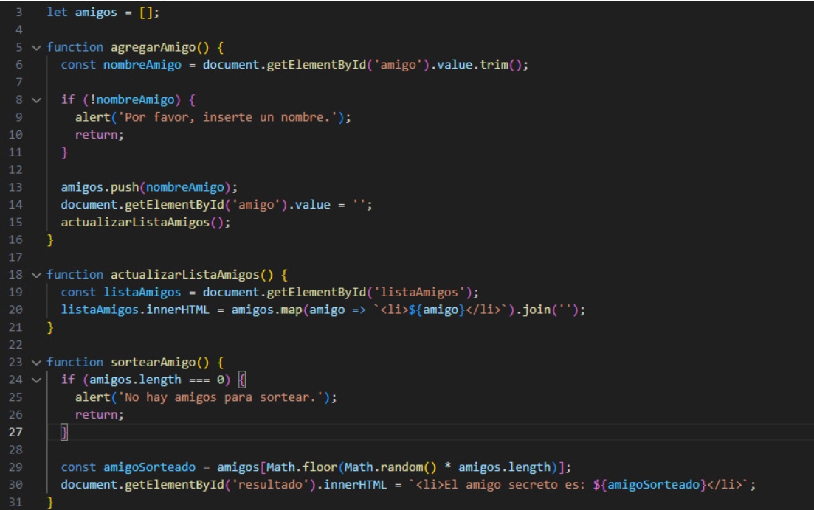

<h1 align="center">*Challenge*</h1>

**Proyecto: Juego amigo secreto**
  
- ¿ En qué consiste ?
  
Esta App, consiste en permitir ingresar nombres en una lista, para luego, donde los datos ingresados se mostrarán en una lista visible en la página, cuando se vaya a sortear para saber quien es el amigo secreto, se debe dar clic en el botón "Sortear Amigo" y este seleccionará de forma aleatoria uno de los nombre ingresados, mostrando el resultado en pantalla de quien es el amigo secreto.

- Para este proyecto, se puso a prueba los conceptos adquiridos en el curso: *Lógica de programación: sumérgete en la programación con JavaScript*.
- Se aplicaron: Funciones y listas.

  
*Mejoras*
- Hacerlo responsive para que pueda ser utilizado en dispositivos móviles.
- Colocar condicionales para que el usuario sólo pueda agregar palabras sin números y sin signos.
- Hacer modificaciones en el aspecto para darle una dinámica y lograr mayor atractivo en el entorno visual a través de código css.
